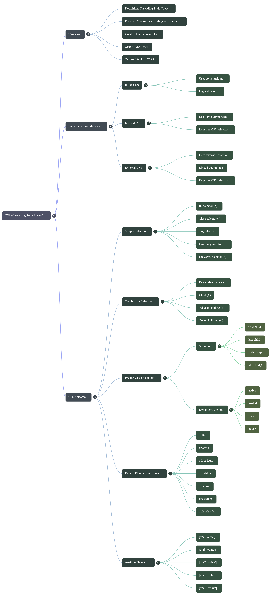

# DAY-3 Running CSS Notes


<h2 align="center">CSS (Cascading Style Sheets)</h2>
CSS is used to apply **colors, layouts, animations, and responsive designs**.

- Proposed: 1994
- Released: 1996 (W3C)
- Current Version: CSS3

---

##  Methods to Apply CSS

### Inline CSS
```html
<h1 style="color:red;">Hello</h1>
```

### Internal CSS
```html
<style>
h1 { color: blue; }
</style>
```

### External CSS
```html
<link rel="stylesheet" href="style.css">
```

---

##  CSS Selectors
CSS selectors are used to target HTML elements.

### Types:
- Universal Selector
- Element Selector
- Class Selector
- ID Selector
- Group Selector
- Attribute Selector
- Pseudo-class Selector
- Pseudo-element Selector

---

## 🖼️CSS Selectors Mind Map


## HTML Tree Diagram Example for Combinator Selectors

